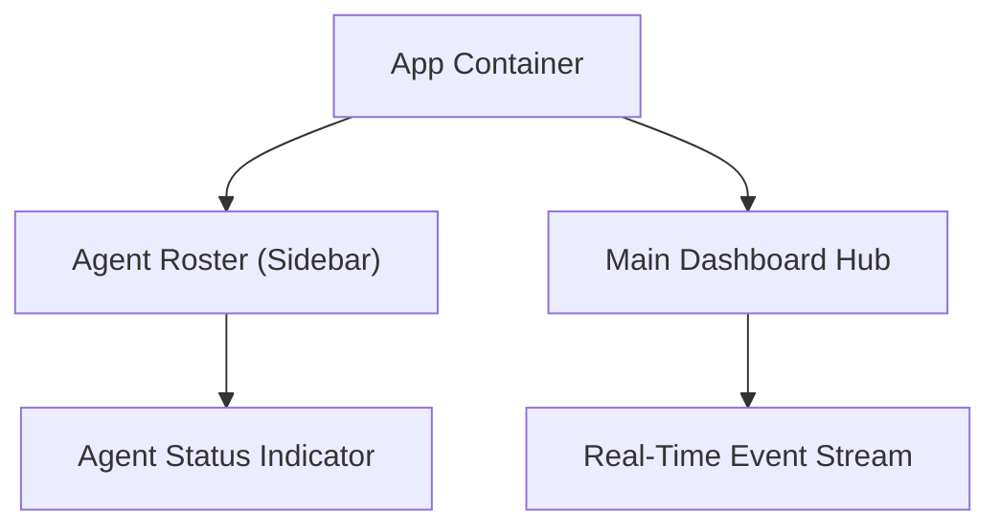
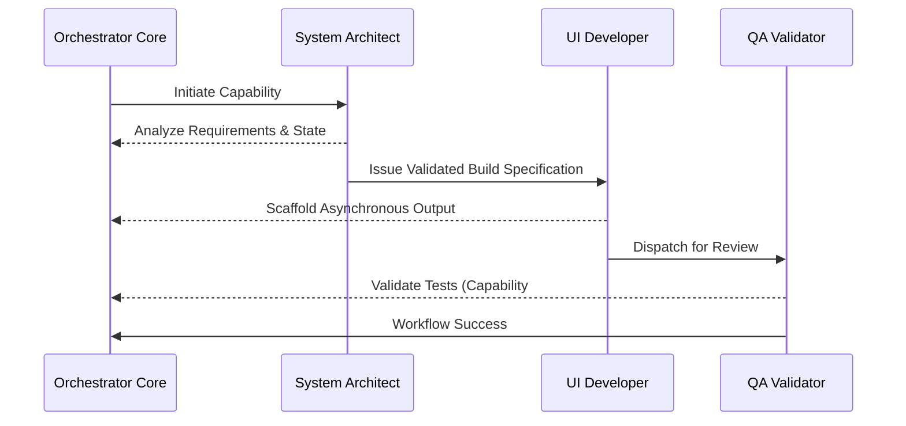

# Nova Orchestrator Architecture

This document contains visual diagrams detailing the application component architecture and the hypothetical agent processes driving the Agent-First workflow.

## Component Architecture

## Agent Network Workflow Loop

